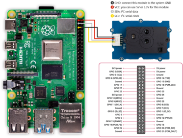

# Configuración del SCD30 en Raspberry Pi 4

### 1. Ensamblar el circuito
Para la conexión del sensor SCD30, se requiere una Raspberry Pi 4 Model B y los cables de conexión (jumpers) incluidos con el sensor, que permiten la conexión directa al microcontrolador. Las conexiones deben realizarse de acuerdo con el siguiente diagrama:


### 2. Crear script de Python
El script [scd30.py](https://github.com/lata-mas/DTHIS-C_JoseRra/blob/main/Scripts/Raspberry/scd30.py) inicializa el sensor `SCD30` y obtiene lecturas de la `concentración de CO2`, `temperatura` y `humedad relativa` para devolverlos como una tupla (CO2, T, HR) al final. 

### 3. Habilitar crontab
Dado que es necesario que este código se ejecute de manera automática al inicializar la Raspberry, se empleará `crontab`, una herramienta de automatización. Para ello, desde la terminal, ingrese el siguiente comando:
```bash
crontab -e
```

Modificar el archivo con la siguiente línea:

```bash
@reboot /bin/bash -c "source /home/pi/venvs/dthisc/bin/activate && python /home/dthisc/dthis-c/scripts/scd30.py"
```
El comando en el crontab se configura para activar el entorno virtual y ejecutar el código en Python. Con esto, se debe considerar que el script incluye un método de acceso a `Thingsboard`. La forma de verificar su correcto funcionamiento es confirmar que los datos se envían correctamente a la instancia propia de `Thingsboard`.
