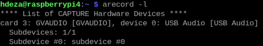

# Configuración del micrófono en Raspberry Pi 4

### 1. Conectar el micrófono
- Apaga la Raspberry Pi.
- Conecta el micrófono a un puerto USB.

### 2. Instalar paqueterías
```bash
sudo apt update
sudo apt install alsa-utils
sudo apt install sox libsox-fmt-all
```

### 3. Comprobar micrófono
Para identificar a que puerto está conectado el micrófono, ejecuta el siguiente comando:
```bash
arecord -l
```
Se desplegará lo siguiente:



En este caso `card 3` es el puerto al que está conectado el micrófono, por lo tanto al ejecutar el comando para la captura de audio, se deberá definir `plughw:3,0`.

### 4. Grabar audio
Para grabar un audio se ejecuta el siguiente comando:
```bash
arecord -D plughw:3,0 -f cd -t wav -d 15 -r 44100 audio.wav
```

---

# Creación de un programa para la obtención de datos de los audios

### 1. Crear scripts acorde a las funciones 
- [grabar.sh](https://github.com/lata-mas/DTHIS-C_JoseRra/blob/main/Scripts/Raspberry/Sonido/grabar.sh): Graba 15 segundos de audio en calidad CD. 
- [dBmax.sh](https://github.com/lata-mas/DTHIS-C_JoseRra/blob/main/Scripts/Raspberry/Sonido/dBmax.sh): Extrae la amplitud máxima del archivo de audio.
- [dBmin.sh](https://github.com/lata-mas/DTHIS-C_JoseRra/blob/main/Scripts/Raspberry/Sonido/dBmin.sh): Extrae la amplitud mínima del archivo de audio.
- [rms.sh](https://github.com/lata-mas/DTHIS-C_JoseRra/blob/main/Scripts/Raspberry/Sonido/rms.sh): Extrae la amplitud RMS, una medida de la potencia promedio del audio.

### 2. Crear un ejecutable para correr todos los scripts
Para evitar que la Raspberry Pi falle por sobrecarga de procesos, se creará un archivo ejecutable `.e` que ejecutará los scripts secuencialmente, asegurando que no haya conflictos entre las instrucciones. Es fundamental especificar la ruta completa del directorio y activar el entorno virtual antes de ejecutar el script que envía la información a ThingsBoard. 

El archivo se crea de la siguiente manera:
```bash
vim executable.e
```

Y su contenido debe ser el siguiente:
```bash
/home/hdeza/Sonido/grabar.sh
/home/hdeza/Sonido/dBmax.sh
/home/hdeza/Sonido/dBmin.sh
/home/hdeza/Sonido/rms.sh
/home/hdeza/venvs/dthis-c/bin/python3 /home/hdeza/dthis/scripts/sound.py
```
